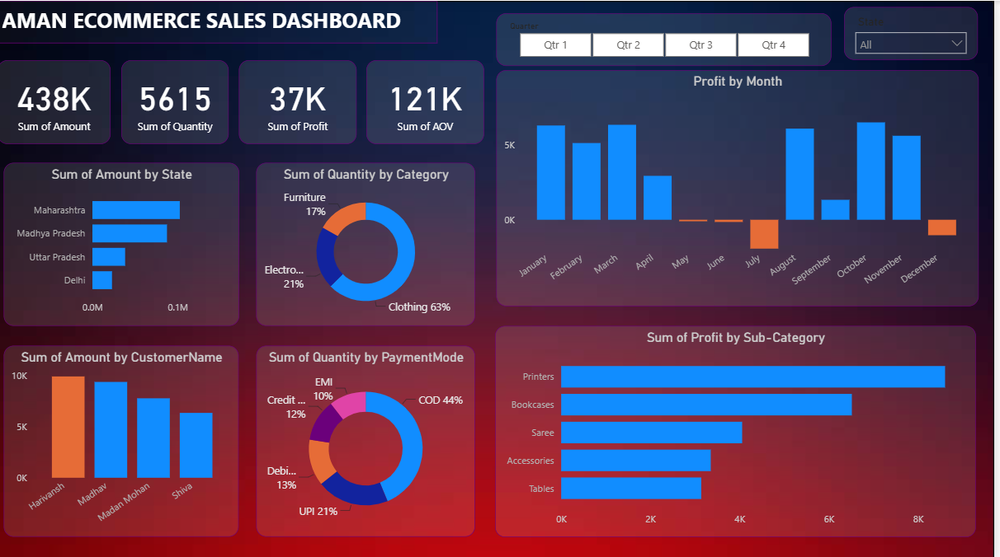

# Aman E-commerce Sales Dashboard

## 📊 Overview
This is an interactive sales dashboard built with **[Power BI /  Excel]** to analyze the performance of an e-commerce business. It provides insights into revenue, profit, quantity sold, and customer behavior.
- Built an interactive Power BI dashboard tracking ₹438K total sales, 5,615 units sold, 
-and ₹37K profit across states, categories, and payment modes
- Analyzed sales by state, identifying Maharashtra as the top-performing region, followed 
-by Madhya Pradesh, Uttar Pradesh, and Delhi
- Segmented product performance by category — Clothing led at 63% of quantity sold, 
-followed by Electronics (21%) and Furniture (17%)
- Designed a profit-by-sub-category view, surfacing Printers and Bookcases as the 
-highest-margin products (~₹8K+ and ₹8K profit respectively)
- Built a monthly profit trend chart, highlighting seasonal dips (May, June, December) 
- vs. peak months (January–March, August, October–November) for business planning
- Tracked payment mode distribution (COD 44%, UPI 21%, Debit 13%, Credit 12%, EMI 10%) 
  to support checkout/payment strategy insights

## 📈 Key Metrics 
- **Total Amount:** $438K
- **Total Quantity Sold:** 5,615 units
- **Total Profit:** $37K
- **Average Order Value (AOV):** $121K

## 🔍 Dashboard Features
- **Sales by State:** Maharashtra leads, followed by MP, UP, and Delhi.
- **Quantity by Category:** Clothing dominates (63%), followed by Electronics (21%) and Furniture (17%).
- **Top Customers:** Harivansh, Madhav, and Shiva are the highest spenders.
- **Payment Mode:** Cash on Delivery (44%) is most popular, followed by UPI (21%).
- **Profit by Sub-Category:** Printers and Bookcases generate the highest profit.

## 🛠️ Tools Used
- [ Power BI Desktop]
- [ Microsoft Excel / SQL for data cleaning]

## 📁 Files in this Repo
- `dashboard_file.pbix` - The main dashboard source file.

## 🚀 How to View
1. Download the `.pbix` file and open it with Power BI Desktop (free).
2. Or view the `dashboard_preview.png` for a quick look.
3. 

## 📌 Notes
- Data has been anonymized for privacy.
- This project was completed as part of a [portfolio / case study].
  
